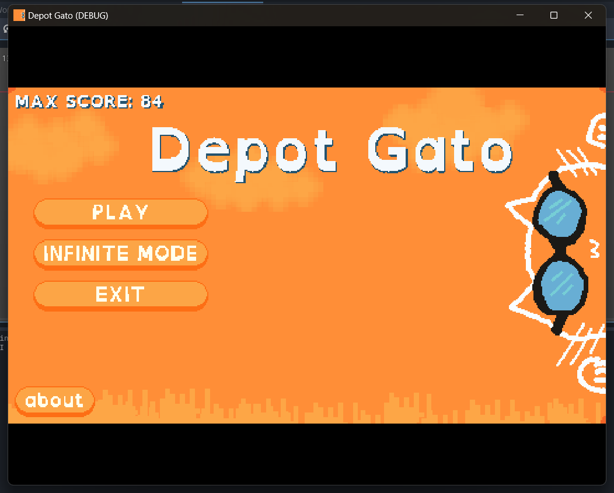

# Depot Gato the Game

Simple game where you play as a Gato and save your friend gatos from being abducted.

**Screenshots**



**Credits**

**Art**: My Brother in Christ I made the art using [pixelorama](https://orama-interactive.itch.io/pixelorama) You can find all editable files in github.

**Audio**

Background Music to Main Level<br/>
Music from #Uppbeat (free for Creators!):<br/>
[https://uppbeat.io/t/michael-grubb/floating-cat](https://uppbeat.io/t/michael-grubb/floating-cat)<br/>
License code: EZBAWEV5GRZW24QZ<br/>

Balloon Pop Sound Effect from [Pixabay](https://pixabay.com/sound-effects/?utm_source=link-attribution&utm_medium=referral&utm_campaign=music&utm_content=84862)

**Fonts:**
Primary Font: [Open Dyslexic](https://opendyslexic.org)

```
Bitstream License:

Copyright (c) 2003 by Bitstream, Inc. All Rights Reserved. Bitstream Vera is a trademark of Bitstream, Inc.

Permission is hereby granted, free of charge, to any person obtaining a copy of the fonts accompanying this license (“Fonts”) and associated documentation files (the “Font Software”), to reproduce and distribute the Font Software, including without limitation the rights to use, copy, merge, publish, distribute, and/or sell copies of the Font Software, and to permit persons to whom the Font Software is furnished to do so, subject to the following conditions:

The above copyright and trademark notices and this permission notice shall be included in all copies of one or more of the Font Software typefaces.

The Font Software may be modified, altered, or added to, and in particular the designs of glyphs or characters in the Fonts may be modified and additional glyphs or characters may be added to the Fonts, only if the fonts are renamed to names not containing either the words “Bitstream” or the word “Vera”.

This License becomes null and void to the extent applicable to Fonts or Font Software that has been modified and is distributed under the “Bitstream Vera” names.

The Font Software may be sold as part of a larger software package but no copy of one or more of the Font Software typefaces may be sold by itself.

THE FONT SOFTWARE IS PROVIDED "AS IS", WITHOUT WARRANTY OF ANY KIND, EXPRESS OR IMPLIED, INCLUDING BUT NOT LIMITED TO ANY WARRANTIES OF MERCHANTABILITY, FITNESS FOR A PARTICULAR PURPOSE AND NONINFRINGEMENT OF COPYRIGHT, PATENT, TRADEMARK, OR OTHER RIGHT. IN NO EVENT SHALL BITSTREAM OR THE GNOME FOUNDATION BE LIABLE FOR ANY CLAIM, DAMAGES OR OTHER LIABILITY, INCLUDING ANY GENERAL, SPECIAL, INDIRECT, INCIDENTAL, OR CONSEQUENTIAL DAMAGES, WHETHER IN AN ACTION OF CONTRACT, TORT OR OTHERWISE, ARISING FROM, OUT OF THE USE OR INABILITY TO USE THE FONT SOFTWARE OR FROM OTHER DEALINGS IN THE FONT SOFTWARE.

Except as contained in this notice, the names of Gnome, the Gnome Foundation, and Bitstream Inc., shall not be used in advertising or otherwise to promote the sale, use or other dealings in this Font Software without prior written authorization from the Gnome Foundation or Bitstream Inc., respectively. For further information, contact: fonts at gnome dot org.
```

Mono Font: [Roboto Mono](https://fonts.google.com)

Proudly made using godot game engine [https://godotengine.org/](https://godotengine.org/)

### Work timeline (This is for me to keep track of work)

-   [x] Ship
-   [x] Level progression as series of balloon spawning in different lanes
-   [x] Remove projectile limits
-   [x] Top to bottom safety projectile
-   [x] Main menu logic for starting game and selecting level & make menu default
-   [x] Main Menu UI & Level Selection UI Theme
-   [x] Game end logic
    -   Game Ending conditions
        -   [x] All balloons popped = Win
        -   [x] Balloon reached to your ship = Lose
-   [x] Game end UI and return main menu
-   [x] Music & Sound Effects
-   [x] Game Save and loading back data
-   [x] Game level data save
-   [x] Level Progress UI
-   [x] Infinite level
-   [x] Save max score board
-   [x] Rethink resource management on shooting
-   [x] Redesign balloon to have cat at bottom ~~and it should go off screen properly~~
-   [x] Rethink ship design
-   [x] Rethink lives as target because of abducting ship
-   [x] FIX Target removing target BUG
-   [x] Not a bug?~~FIX Only unlock level if player wins the game~~
-   [x] Pause Menu: Pause Game and Main Menu, Reload Level Button
-   [x] Give this game a name, Design nice graphics for the name
-   [x] Working exit button, About Box and all the credits and licenses
-   [ ] Make a working web build and deploy using vercel and make a kubre.in subdomain
-   [ ] Mobile Support
